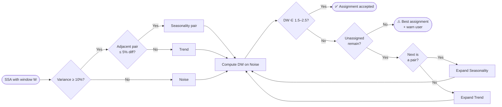

# Time Series Explorer (`tseda`)

<p align="center">
	<a href="#non-developer-quick-start">
		
	</a>
</p>

<p align="center">
	<strong>Time series exploration and decomposition for fast, reliable insights.</strong>
</p>

<p align="center">
	<a href="https://pypi.org/project/tseda/"></a>
	<a href="https://pypi.org/project/tseda/"></a>
	<a href="https://tseda.readthedocs.io/en/latest/"></a>
	
</p>

<p align="center">
	<a href="https://tseda.readthedocs.io/en/latest/"><strong>Read the Docs</strong></a>
</p>

An application for time series exploration.

## Overview

`tseda` lets you explore regularly sampled time series with a sampling frequency of one hour or greater. It is currently limited to 2,000 samples (this is configurable).

## Three-Step Exploration Workflow

### (a) Initial Assessment

Explore the distribution and spread of values using a kernel density estimate and box plot. You get to see the raw distribution of the values. The PACF and ACF provide clues about seasonality and autoregressive components.

### (b) Decomposition Using Singular Spectral Analysis

On the basis of the sampling frequency, a window for SSA is determined. This is a heuristic assignment. For example:

| Sampling Frequency | Window Size |
|--------------------|-------------|
| Hourly             | 24          |
| Monthly            | 12          |
| Quarterly          | 4           |

This can be changed in the UI. Based on the eigen value distribution, observations from the ACF plot and the eigen vector plot, the seasonal components can be determined if present. Based on these initial plots, the user needs to input a set of groupings and reconstruct the series with these groupings. The reconstruction plots are shown. If there is structure in the series, then change point analysis can be done using the fact that the components are smooth. A change point plot is shown. The explained variance from signal and noise components and the assessment of the noise structure (independent or correlated) is provided.

The decomposition step now also includes an automatic grouping heuristic. Components explaining at least 10% of the total SSA variance are scanned in rank order. Near-equal adjacent pairs within a 5% difference are suggested as seasonality, other components above the threshold are suggested as trend, and all remaining components are left to noise. The Durbin-Watson (DW) statistic is then computed on the noise residual; if DW falls outside [1.5, 2.5] the algorithm expands the assignment one component at a time, tracking the assignment closest to DW = 2.0, until the criterion is met or all components are consumed. If the criterion is never met the user is prompted to try a different window size. The UI renders the result as a suggested grouping table, prepopulates the Trend, Seasonality, and Noise inputs, and still lets you override before applying reconstruction. Changing the window size slider re-runs the heuristic automatically.



### (c) Observation Logging

The SSA is based on the eigen decomposition of the trajectory matrix. Though the raw signal is correlated, the eigenvectors are uncorrelated. If we assume that the signal is Gaussian, this also implies independence. We can use the Akaike Information Criterion for model selection and determine the AIC as a function of the rank of the model. This is shown in the observation page. An automatic summary of all the observations is provided.

## Notebook Interface

The package also provides a notebook interface to these features. If you have a new dataset that you want to analyze, look at the data loader directory for examples. Download your dataset, clean it, produce your time series, and analyze it with `tseda`.

## Requirements

**Python 3.13 or higher** is required to run this package.

Before starting the installation, verify your Python version:

```bash
python --version
```

Ensure the output shows Python 3.13 or higher. If not, please upgrade Python before proceeding.

## Install And Run From PyPI

### Recommended: Using Conda

Conda is the recommended package manager for development and installation (development was done with conda):

```bash
conda create -n tseda python=3.13
conda activate tseda
pip install tseda
```

Then run the app:

```bash
tseda
```

## Non-Developer Quick Start

If you just want to run the app with minimal setup:

1. Install with `pipx`:

```bash
pipx install tseda
```

2. Launch the app:

```bash
tseda
```

3. Open your browser at `http://127.0.0.1:8050`.

If `pipx` is not available, use the standard Python install instructions below.

### 1. Install

Verify you have Python 3.13 or higher installed:

```bash
python --version
```

Create and activate a virtual environment, then install from PyPI:

```bash
python -m venv .venv
source .venv/bin/activate        # Windows: .venv\Scripts\activate
pip install tseda
```

### 2. Run The Dash App

```bash
tseda
```

You can also launch with Python module execution:

```bash
python -m tseda
```

Note: `python tseda` is not a valid way to run an installed package because Python treats `tseda` as a local script path.

By default, the app starts at `http://127.0.0.1:8050`.

Optional runtime overrides:

```bash
TSEDA_HOST=0.0.0.0 TSEDA_PORT=8050 TSEDA_DEBUG=false tseda
```

### 3. Upload Your Data

- Click **"Drag and Drop or Select Files"** in the Initial Assessment panel.
- Your file must be a **CSV or Excel** file with at least two columns: a **timestamp** column (first) and a **numeric value** column (second).
- The data must be **regularly sampled at hourly or lower frequency** (e.g., hourly, daily, monthly).
- The dataset must contain **no missing values** (NA / NaN). Clean your data before uploading.
- Files are limited to **2,000 rows** (configurable via `MAX_FILE_LINES` in `ts_analyze_ui.py`).

### 4. Explore In Three Steps

| Step | Panel | What to do |
|------|-------|------------|
| 1 | **Initial Assessment of Time Series** | Review distribution plots (KDE, box plot) and the ACF / PACF for autocorrelation patterns. |
| 2 | **Time Series Decomposition** | Review the suggested grouping table, adjust the prepopulated Trend, Seasonality, and Noise inputs if needed, then click **Apply Grouping**. |
| 3 | **Observation Logging** | Review the AIC rank diagnostics, read the auto-generated summary, and add your own observations before saving the report. |

## Development Install (From Source)

If you are developing locally from source:

```bash
pip install -e .
tseda
```

## Build With uv

1. Build source and wheel distributions:

```bash
uv build
```

2. Validate distributions before upload:

```bash
uvx twine check dist/*
```

## Documentation (Sphinx)

### Build locally

```bash
pip install -r docs/requirements.txt
sphinx-build -b html docs/source docs/_build/html
```

You can also use the Makefile:

```bash
make -C docs html
```

The generated site will be available in `docs/_build/html`.

### Publish on Read the Docs

This repository includes `.readthedocs.yaml` configured to build docs from `docs/source/conf.py`.

1. Push the repository to GitHub (or another supported provider).
2. Sign in to Read the Docs and import the project.
3. In Read the Docs project settings:
	- Set the default branch.
	- Confirm the config file path is `.readthedocs.yaml`.
4. Trigger a build from the Read the Docs dashboard.
5. Optionally enable a custom domain and versioned docs.

If the build fails, inspect the Read the Docs build logs and replicate locally using:

```bash
make -C docs html
```

## User Guide

A detailed user guide is available at [`docs/user_guide.md`](docs/user_guide.md). A video version of the user guide is also available on [YouTube](https://youtu.be/baoJrIpSTE8). The written guide covers:

- Data requirements and input format
- Step-by-step walkthrough of all three workflow phases
- Interpreting SSA decomposition outputs (eigenvalue profile, component groupings, Durbin-Watson test)
- Change point detection
- AIC-based model order selection
- Exporting reports and knowledge base entries
- Setting up the Gemini chatbot integration

## Contributing & Feature Requests

If you'd like to request a feature or report an issue, please [open an issue](https://github.com/rajivsam/tseda/issues) on GitHub. You're also welcome to reach out to me directly.
